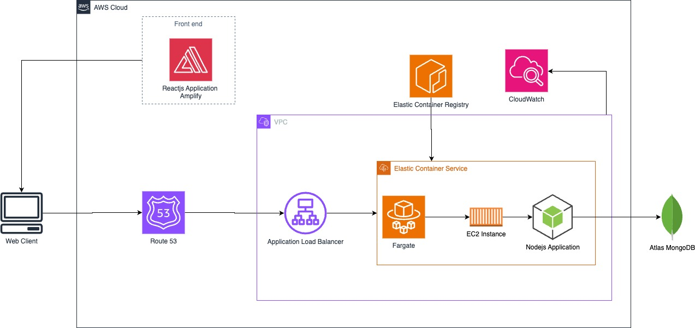

# Garment Finder Project

This project is a monorepo containing both the frontend and backend components of the Garment Finder application.

## Project Structure

The project is organized into two main folders:

1. `garment-finder-frontend`: Contains the React.js frontend application
2. `garment-finder-backend`: Contains the Node.js Express backend application

## Technologies Used

### Frontend
- React.js
- Deployed on AWS Amplify

### Backend
- Node.js
- Express.js
- Containerized using Docker
- Deployed on AWS ECS (Elastic Container Service) using EC2 instances

### CI/CD
- GitHub Actions (for backend deployment)
- AWS Amplify built-in CI/CD (for frontend deployment)

### AWS Services
- ECR (Elastic Container Registry)
- ECS (Elastic Container Service)
- EC2 (Elastic Compute Cloud)
- Route 53
- ELB (Elastic Load Balancer)
- Certificate Manager (for HTTPS)

## Deployment

### Frontend
- URL: https://garmentfinder.shop
- Deployment: AWS Amplify with GitHub integration for automatic deployments

### Backend
- URL: https://app.garmentfinder.shop
- Deployment Process:
  1. GitHub Actions workflow builds the Docker image
  2. Image is pushed to AWS ECR
  3. AWS ECS deploys the container on EC2 instances

### Domain and DNS
- Domain registered with GoDaddy
- DNS managed using AWS Route 53 Hosted Zone

## Traffic Routing
- AWS Route 53 is used for DNS management
- AWS ELB (Elastic Load Balancer) routes traffic to the backend
- HTTPS certificates are implemented for secure connections

## Getting Started

This project uses a Makefile to simplify setup and execution. Make sure you have `make` installed on your system.

1. Clone the repository:
2. Install dependencies:
make install
3. Build the project:
make build
4. Start the application:
make start
This will start both the frontend and backend services.

## Available Make Commands

- `make install`: Install dependencies for both frontend and backend
- `make build`: Build both frontend and backend
- `make test`: Run tests for both frontend and backend

You can also run commands for specific parts of the application:

- Frontend commands: `make install-frontend`, `make start-frontend`, `make build-frontend`, `make test-frontend`
- Backend commands: `make install-backend`, `make start-backend`, `make build-backend`, `make test-backend`

## Infrastructure Architecture Diagram
